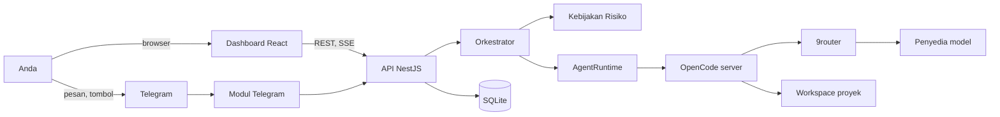

# Implementation Plan: AI House

- Versi: 0.1 (draf)
- Tanggal: 7 Oktober 2026
- Dokumen pendamping: `PRD.md`

Rencana ini menjelaskan cara membangun AI House. Isinya keputusan teknis, arsitektur, struktur folder, model data, fase kerja, dan pengujian.

---

## 1. Keputusan teknis

| Area | Pilihan | Alasan |
|------|---------|--------|
| Bahasa | TypeScript (mode strict) | Satu bahasa untuk API, web, dan kontrak data. Sesuai stack yang Anda kuasai. |
| Monorepo | pnpm workspaces | Ringan. Paket `shared` dipakai bersama oleh API dan web. |
| Backend | NestJS dengan adapter Fastify | Struktur modul jelas, injeksi dependensi bawaan, Fastify lebih ringan dari Express. |
| Frontend | React + Vite + Tailwind CSS | Build cepat, tanpa SSR yang tidak diperlukan. |
| Data fetching | TanStack Query + React Router | Cache dan sinkronisasi status server tanpa state manager besar. |
| Database | SQLite (better-sqlite3) | Tanpa server database terpisah. Cukup untuk satu pemilik. |
| ORM | Drizzle ORM | Ringan, tipe aman, mendukung SQLite dan PostgreSQL. Migrasi ke PostgreSQL tetap mudah. |
| Validasi | Zod | Satu skema untuk validasi runtime dan tipe statis. Dipakai di paket `shared`. |
| Telegram | grammY | Pustaka TypeScript yang terawat. Mendukung long polling dan webhook. |
| Runtime agen | OpenCode (`opencode serve` + `@opencode-ai/sdk`) | Sesuai pilihan Anda. Cadangan: `opencode run` lewat proses anak. |
| Model AI | 9router (`http://localhost:20128/v1`) | Satu endpoint OpenAI-compatible untuk banyak penyedia. Didaftarkan sebagai provider kustom di OpenCode. |
| Antrean | Antrean dalam proses, disimpan di SQLite | Tidak perlu Redis. Antrean pulih setelah restart. |
| Realtime | Server-Sent Events (SSE) | Satu arah dari server ke browser. Lebih sederhana dari WebSocket. |
| Lint dan format | Biome | Satu alat untuk lint dan format. Cepat. |
| Tes | Vitest, Supertest, Playwright | Unit dan integrasi dengan Vitest. Smoke test dashboard dengan Playwright. |
| Kontainer | Docker Compose | Menyatukan API, OpenCode, dan 9router. |

Keputusan yang bergantung pada hasil Fase 0: memakai SDK OpenCode atau proses anak `opencode run` sebagai adapter utama. Ada laporan publik bahwa `session.prompt()` pada provider kustom OpenAI-compatible mengembalikan respons kosong. Fase 0 membuktikan perilaku di versi yang Anda pasang.

## 2. Arsitektur

### Lapisan

Ketergantungan hanya mengarah ke dalam.

```
Antarmuka (HTTP, SSE, Telegram)
        |
Aplikasi (use case)
        |
Domain (entitas, aturan, port)
        ^
Infrastruktur (SQLite, OpenCode, grammY) mengimplementasikan port
```

- **Domain** tidak mengimpor NestJS, Drizzle, grammY, atau OpenCode.
- **Aplikasi** berisi use case, misalnya `CreateProject`, `PlanProject`, `DispatchTask`, `DecideApproval`.
- **Infrastruktur** berisi adapter yang mengimplementasikan port domain.
- **Antarmuka** hanya menerjemahkan input menjadi pemanggilan use case.

### Komponen



### Alur eksekusi tugas

1. `PlanProject` meminta agen PM menyusun rencana. Hasilnya berupa JSON yang divalidasi Zod.
2. Anda menyetujui rencana. Sistem menyimpan tugas dan ketergantungannya.
3. Orkestrator memilih tugas yang prasyaratnya selesai, sesuai batas konkurensi.
4. `DispatchTask` membuat sesi OpenCode di workspace proyek dengan profil divisi.
5. Runtime mengalirkan kejadian (teks, pemanggilan alat, permintaan izin).
6. Kebijakan risiko menilai setiap permintaan izin:
   - tingkat 0 sampai 2 (daftar izin): dijawab otomatis.
   - tingkat 3: dibuat `Approval`, dikirim ke Telegram dan dashboard, run berhenti sementara.
   - tingkat 4: ditolak.
7. Saat Anda memutuskan, `DecideApproval` meneruskan jawaban ke OpenCode.
8. Saat run selesai, sistem menyimpan hasil dan artefak, lalu memicu tugas berikutnya.
9. Setelah semua tugas selesai, PM menyusun laporan akhir dan mengirimnya ke Telegram.

## 3. Struktur folder

```
ai-house/
  apps/
    api/
      src/
        main.ts
        app.module.ts
        config/                  # env, validasi konfigurasi
        db/
          schema/                # skema Drizzle per tabel
          migrations/
        modules/
          divisions/
            domain/              # Division, DivisionRepository (port)
            application/         # LoadDivisions, GetDivision
            infrastructure/      # FileDivisionRepository (baca house/divisions)
            http/                # controller
          projects/
            domain/ application/ infrastructure/ http/
          tasks/
            domain/ application/ infrastructure/ http/
          approvals/
            domain/              # Approval, RiskPolicy
            application/         # RequestApproval, DecideApproval
            infrastructure/ http/
          agents/
            domain/              # AgentRuntime (port), RunEvent
            application/         # DispatchTask, CancelRun
            infrastructure/
              opencode-sdk.runtime.ts
              opencode-cli.runtime.ts
          telegram/
            bot.service.ts
            commands/            # satu file per perintah
            callbacks/           # tombol persetujuan
            formatters/          # format pesan
          events/                # penerbit kejadian dan endpoint SSE
          audit/
          auth/                  # login dashboard
        shared/                  # error, logger, util
      test/
    web/
      src/
        app/                     # router, provider
        features/
          house/                 # halaman Gedung
          projects/
          approvals/
          activity/
          divisions/
          settings/
        components/ui/           # tombol, tabel, badge, sheet
        lib/                     # klien API, klien SSE, format tanggal
        styles/tokens.css
      index.html
  packages/
    shared/
      src/
        schemas/                 # skema Zod
        types/
  house/
    divisions/                   # satu file .md per divisi
    policies/
      risk-rules.yaml
  workspaces/                    # keluaran proyek (di-gitignore)
  data/                          # SQLite dan backup (di-gitignore)
  docker/
    api.Dockerfile
    opencode.Dockerfile
  docker-compose.yml
  docs/
    adr/                         # catatan keputusan arsitektur
  biome.json
  pnpm-workspace.yaml
  .env.example
```

Aturan struktur:

- Satu modul, satu tanggung jawab.
- Controller hanya memanggil use case. Tidak ada logika bisnis di controller.
- Kode lintas modul hanya lewat port atau paket `shared`.

## 4. Model data

Semua `id` memakai ULID. Semua tabel punya `created_at` dan `updated_at`.

| Tabel | Kolom utama |
|-------|-------------|
| `divisions` | `id` (slug), `name`, `model`, `prompt_hash`, `config_json`, `enabled` |
| `projects` | `id`, `title`, `goal`, `status`, `workspace_path`, `token_budget`, `tokens_used` |
| `tasks` | `id`, `project_id`, `division_id`, `title`, `description`, `done_criteria`, `status`, `attempt`, `result_summary` |
| `task_dependencies` | `task_id`, `depends_on_id` |
| `runs` | `id`, `task_id`, `session_id`, `status`, `started_at`, `ended_at`, `tokens_in`, `tokens_out`, `error` |
| `approvals` | `id`, `run_id`, `risk_level`, `action_type`, `action_summary`, `payload_json`, `status`, `decided_by`, `decided_at`, `expires_at` |
| `artifacts` | `id`, `project_id`, `task_id`, `path`, `kind`, `size` |
| `telegram_messages` | `id`, `chat_id`, `direction`, `text`, `project_id`, `telegram_message_id` |
| `audit_log` | `id`, `actor`, `event_type`, `subject_type`, `subject_id`, `detail_json`, `occurred_at` |
| `settings` | `key`, `value_json` |

Indeks: `tasks(project_id, status)`, `runs(task_id)`, `approvals(status, expires_at)`, `audit_log(occurred_at)`.

## 5. Konfigurasi divisi

Setiap divisi berupa satu file Markdown dengan frontmatter. Menambah divisi berarti menambah satu file.

```md
---
id: software-development
name: Software/App Development
description: Menulis, mengubah, dan memperbaiki kode.
model: 9router/<nama-model>
permission:
  read: allow
  edit: workspace
  bash:
    allow: ["pnpm test*", "pnpm lint*", "pnpm build", "git status", "git diff*", "git add*", "git commit*"]
    ask: ["pnpm add*", "pnpm install*", "git push*"]
    deny: ["rm -rf*", "git push --force*", "curl * | sh"]
  webfetch: allow
---

Kamu adalah divisi Software Development di AI House.

Aturan kerja:
- Baca spesifikasi di `design/spec.md` sebelum menulis kode.
- Tulis semua file hanya di dalam workspace proyek.
- Tulis ringkasan hasil di `reports/<id-tugas>.md`.
- Jika kriteria selesai tidak jelas, tulis pertanyaan di laporan dan berhenti.
```

Loader membaca folder `house/divisions`, memvalidasi frontmatter dengan Zod, lalu menghasilkan konfigurasi agen OpenCode saat run dimulai. Nama kunci izin harus cocok dengan skema konfigurasi OpenCode versi terpasang. Fase 0 memeriksa ini.

Provider 9router didaftarkan di konfigurasi OpenCode sebagai provider kustom:

```json
{
  "provider": {
    "9router": {
      "npm": "@ai-sdk/openai-compatible",
      "name": "9router",
      "options": {
        "baseURL": "http://localhost:20128/v1",
        "apiKey": "{env:NINEROUTER_API_KEY}"
      },
      "models": {
        "<nama-model>": { "name": "<nama-model>" }
      }
    }
  }
}
```

Nama model diambil dari `GET /v1/models` milik 9router, atau Anda isi manual.

## 6. Port runtime agen

```ts
export interface AgentRuntime {
  startRun(input: StartRunInput): Promise<RunHandle>;
  cancelRun(runId: string): Promise<void>;
  respondPermission(
    runId: string,
    permissionId: string,
    decision: "allow" | "deny",
  ): Promise<void>;
  events(runId: string): AsyncIterable<RunEvent>;
}

export type RunEvent =
  | { type: "text"; content: string }
  | { type: "tool"; name: string; summary: string }
  | { type: "permission"; permissionId: string; action: ActionRequest }
  | { type: "usage"; tokensIn: number; tokensOut: number }
  | { type: "done"; summary: string }
  | { type: "error"; message: string };
```

Dua implementasi:

- `OpenCodeSdkRuntime`: memakai `createOpencodeClient` ke `opencode serve`. Mengikuti kejadian lewat SSE milik OpenCode.
- `OpenCodeCliRuntime`: menjalankan `opencode run -m 9router/<model>` sebagai proses anak, membaca keluarannya. Dipakai bila SDK gagal di Fase 0.

Pilihan runtime ada di konfigurasi (`AGENT_RUNTIME=sdk|cli`). Domain dan use case tidak berubah.

Jika `opencode run` tidak mendukung permintaan izin interaktif, kebijakan risiko dipaksakan lewat konfigurasi izin (`allow`, `ask`, `deny`) dan lewat pemeriksaan jejak aksi setelah run. Fase 0 menetapkan pendekatan yang berlaku.

## 7. Bot Telegram

- Mode: long polling untuk pengembangan dan VPS tanpa domain. Webhook bila ada domain HTTPS.
- Middleware pertama memeriksa `from.id === TELEGRAM_OWNER_ID`. Selain itu diabaikan dan dicatat ke audit log.
- Pesan teks bebas masuk ke use case `ChatWithPm`. PM membalas, dan bila perlu membuat proyek.
- Setiap perintah berada di file sendiri di `commands/`.
- Persetujuan memakai inline keyboard. `callback_data` hanya memuat `approval:<id>:<allow|deny>` dengan ID pendek, kurang dari 64 byte.
- Pesan panjang dipecah di batas paragraf (batas Telegram 4096 karakter).
- Pembatas laju per chat agar tidak melewati batas API Telegram.
- Pesan yang gagal terkirim diulang dengan jeda bertahap.

| Perintah | Fungsi |
|----------|--------|
| `/start` | Perkenalan dan bantuan singkat |
| `/status` | Ringkasan proyek aktif dan antrean persetujuan |
| `/proyek` | Daftar proyek |
| `/tugas [proyek]` | Tugas dan statusnya |
| `/setuju <id>` dan `/tolak <id>` | Memutuskan persetujuan lewat teks |
| `/batal <id>` | Membatalkan tugas atau proyek |
| `/divisi` | Daftar divisi dan statusnya |
| `/laporan` | Laporan proyek terakhir |
| `/stop` | Menghentikan semua run |

## 8. API dan SSE

| Metode | Path | Fungsi |
|--------|------|--------|
| POST | `/api/auth/login` | Login dashboard |
| GET | `/api/house` | Status semua divisi |
| GET | `/api/divisions/:id` | Detail divisi |
| GET | `/api/projects` | Daftar proyek |
| POST | `/api/projects` | Buat proyek |
| GET | `/api/projects/:id` | Detail, tugas, artefak |
| POST | `/api/projects/:id/plan/approve` | Setujui rencana |
| GET | `/api/approvals?status=pending` | Antrean persetujuan |
| POST | `/api/approvals/:id/decision` | Setuju atau tolak |
| POST | `/api/runs/stop-all` | Hentikan semua |
| GET | `/api/audit` | Audit log dengan filter |
| GET | `/api/events` | Aliran SSE |
| GET | `/health` | Pemeriksaan kesehatan |

Semua body dan respons divalidasi dengan skema dari `packages/shared`.

Jenis kejadian SSE: `division.status`, `task.updated`, `run.event`, `approval.created`, `approval.decided`, `project.updated`.

## 9. Desain antarmuka

### Token desain (`tokens.css`)

| Token | Terang | Gelap |
|-------|--------|-------|
| `--bg` | `#F6F4EF` | `#141310` |
| `--surface` | `#FFFFFF` | `#1D1B17` |
| `--ink` | `#1B1A17` | `#ECE8DF` |
| `--ink-muted` | `#5E5A50` | `#A39E91` |
| `--line` | `#DAD6CC` | `#35322B` |
| `--accent` | `#B4410F` | `#E0773F` |
| `--ok` | `#2F7D4F` | `#4DB37A` |
| `--warn` | `#9A6B0F` | `#D9A441` |
| `--danger` | `#B42318` | `#F0766B` |

Periksa kontras setiap pasangan teks dan latar dengan alat uji kontras sebelum dipakai. Angka di atas adalah titik awal.

### Halaman dan komponen utama

| Halaman | Komponen kunci |
|---------|----------------|
| Gedung | `FloorGrid`, `DivisionRoom` (nama, status, tugas aktif, aktivitas terakhir), `PendingApprovalsStrip` |
| Proyek | `ProjectTable`, `TaskBoard` (kolom per status), `ArtifactList`, `RunTimeline` |
| Persetujuan | `ApprovalCard`, `ApprovalSheet` (mobile), `RiskBadge` |
| Aktivitas | `LogStream` (huruf mono, virtualisasi), `FilterBar` |
| Divisi | `DivisionHeader`, `PermissionTable`, `PromptViewer` |
| Pengaturan | `ConnectionForm`, `LimitsForm` |

### Aturan implementasi UI

- Mobile first. Tulis gaya dasar untuk 360 px, lalu tambah `sm`, `lg`.
- Navigasi bawah di mobile, sidebar di desktop.
- Status memakai ikon, teks, dan warna. Tidak hanya warna.
- Klien SSE tersambung ulang otomatis dan menampilkan indikator "terputus" bila gagal.
- Animasi hanya `transform` dan `opacity`, berdurasi di bawah 200 ms, dimatikan bila `prefers-reduced-motion`.
- Larangan "AI slop" pada `PRD.md` bagian 11 menjadi daftar periksa saat tinjauan kode UI.

## 10. Standar kode bersih

| Aturan | Batas |
|--------|-------|
| Panjang file | Sekitar 200 baris. Pecah bila lebih. |
| Panjang fungsi | Sekitar 30 baris. |
| Tipe `any` | Dilarang. Gunakan `unknown` lalu persempit dengan Zod. |
| Penamaan | Nama menjelaskan maksud. Fungsi berupa kata kerja, tipe berupa kata benda. |
| Validasi | Di batas sistem saja: HTTP, Telegram, file konfigurasi, keluaran model. |
| Galat | Kelas galat bertipe di domain. Tidak melempar `string`. |
| Dependensi | Lewat injeksi konstruktor. Tidak ada singleton global. |
| Komentar | Menjelaskan alasan, bukan apa yang sudah jelas dari kode. |
| Commit | Conventional Commits (`feat:`, `fix:`, `refactor:`). |
| Keputusan arsitektur | Satu file ADR per keputusan di `docs/adr/`. |

Biome dan `tsc --noEmit` berjalan di pre-commit dan di CI.

## 11. Pengujian

| Jenis | Cakupan | Alat |
|-------|---------|------|
| Unit | Kebijakan risiko, perencana tugas, pengurutan ketergantungan, loader divisi, formatter Telegram | Vitest |
| Integrasi | Use case dengan SQLite dalam memori dan `FakeAgentRuntime` | Vitest |
| API | Controller, auth, validasi | Supertest |
| Kontrak adapter | `OpenCodeSdkRuntime` dan `OpenCodeCliRuntime` terhadap OpenCode asli dengan model murah | Vitest (dijalankan manual atau terjadwal) |
| Telegram | Handler dengan API bot palsu | Vitest |
| E2E | Login, lihat Gedung, setujui aksi, hentikan semua, di lebar 390 px dan 1280 px | Playwright |

Kasus uji wajib:

- Aksi tingkat 3 tidak pernah berjalan tanpa persetujuan.
- Aksi tingkat 4 selalu ditolak.
- Persetujuan kedaluwarsa menjadi penolakan.
- Pesan dari ID Telegram lain tidak memicu use case.
- Restart saat run berjalan: run ditandai ulang dan tugas dapat diulang.
- Anggaran token terlampaui menghentikan tugas.
- Path di luar workspace ditolak.

## 12. Keamanan

- Rahasia (`TELEGRAM_BOT_TOKEN`, `NINEROUTER_API_KEY`, hash kata sandi) hanya di `.env`. `.env.example` berisi nama saja.
- Kata sandi dashboard disimpan sebagai hash argon2. Cookie sesi `HttpOnly`, `SameSite=Strict`, `Secure` di produksi.
- Pembatas laju pada `/api/auth/login`.
- Tiap proyek punya workspace sendiri. Direktori kerja OpenCode diatur ke folder itu. Validator path menolak `..` dan tautan simbolik keluar workspace.
- Daftar izin dan penolakan perintah ada di `house/policies/risk-rules.yaml`. Contoh penolakan: `rm -rf /`, `git push --force`, perintah yang mengunduh lalu langsung mengeksekusi skrip, akses ke `~/.ssh` dan `.env` di luar workspace.
- Isi dari web, email, atau file diperlakukan sebagai data. Prompt sistem divisi menyatakan hal ini.
- Audit log bersifat tambah-saja (tanpa update atau delete lewat aplikasi).
- OpenCode dan 9router hanya mendengarkan `127.0.0.1` atau jaringan Docker internal.
- Backup SQLite harian ke folder `data/backup/`, simpan 14 salinan terakhir.

## 13. Deployment

### Variabel lingkungan

| Variabel | Fungsi |
|----------|--------|
| `TELEGRAM_BOT_TOKEN` | Token dari BotFather |
| `TELEGRAM_OWNER_ID` | ID Telegram pemilik |
| `NINEROUTER_BASE_URL` | Default `http://localhost:20128/v1` |
| `NINEROUTER_API_KEY` | Kunci 9router |
| `OPENCODE_SERVER_URL` | Default `http://127.0.0.1:4096` |
| `AGENT_RUNTIME` | `sdk` atau `cli` |
| `DATABASE_URL` | Default `file:./data/house.db` |
| `WORKSPACES_DIR` | Default `./workspaces` |
| `MAX_CONCURRENT_RUNS` | Default `2` |
| `APPROVAL_TIMEOUT_MIN` | Default `30` |
| `DASHBOARD_PASSWORD_HASH` | Hash argon2 |
| `SESSION_SECRET` | Rahasia cookie |

### Docker Compose

Tiga layanan:

- `api`: NestJS dan berkas statis dashboard hasil build.
- `opencode`: menjalankan `opencode serve`. Dipasang lewat `npm i -g opencode-ai`.
- `router`: citra `decolua/9router`, port 20128. Lewati layanan ini bila 9router sudah berjalan di mesin Anda.

Semua layanan punya `healthcheck`. Volume: `data/`, `workspaces/`, dan konfigurasi 9router.

## 14. Fase implementasi

Estimasi berikut mengasumsikan satu pengembang, sekitar 4 jam per hari. Sesuaikan setelah Fase 0.

| Fase | Isi | Estimasi |
|------|-----|----------|
| 0 | Fondasi dan spike | 3 hari |
| 1 | Domain dan database | 4 hari |
| 2 | Runtime agen dan divisi Software Development | 5 hari |
| 3 | Telegram dan divisi PM | 5 hari |
| 4 | Persetujuan dan pengaman | 4 hari |
| 5 | Dashboard web | 10 hari |
| 6 | Delapan divisi lain | 4 hari |
| 7 | Pengerasan, Docker, dokumentasi | 4 hari |

Total sekitar 39 hari kerja, atau 8 minggu pada ritme di atas. MVP (Fase 0 sampai 5) sekitar 31 hari.

### Fase 0: Fondasi dan spike

Tugas:

- Buat monorepo, Biome, `tsc`, Vitest, Husky, dan CI dasar.
- Spike A: jalankan `opencode serve`, daftarkan 9router sebagai provider kustom, kirim satu prompt lewat `@opencode-ai/sdk`.
- Spike B: jalankan `opencode run -m 9router/<model>` dari proses anak, tangkap keluarannya.
- Spike C: pastikan format izin per agen dan cara menangani permintaan izin di versi OpenCode terpasang.
- Tulis ADR: runtime utama (SDK atau CLI).

Selesai bila: satu prompt berhasil menghasilkan teks dan satu file di workspace lewat jalur yang dipilih, dan ADR tersimpan.

### Fase 1: Domain dan database

Tugas:

- Skema Drizzle dan migrasi untuk semua tabel di bagian 4.
- Entitas dan aturan domain: status tugas, ketergantungan, tingkat risiko.
- Repositori dan use case dasar: `CreateProject`, `AddTasks`, `ListProjects`.
- Penerbit kejadian dalam proses.

Selesai bila: tes unit domain lulus, tes integrasi use case dengan SQLite memori lulus.

### Fase 2: Runtime agen dan divisi Software Development

Tugas:

- Port `AgentRuntime` dan adapter terpilih dari Fase 0.
- Loader divisi dari `house/divisions/*.md`.
- Pembuat workspace per proyek dan validator path.
- Use case `DispatchTask` dan `CancelRun`.
- Antrean tugas dengan batas konkurensi dan pemulihan setelah restart.

Selesai bila: satu tugas Software Development berjalan dari awal sampai akhir pada workspace terisolasi dan hasilnya tersimpan.

### Fase 3: Telegram dan divisi PM

Tugas:

- Modul grammY dengan middleware ID pemilik.
- Perintah inti dan formatter pesan.
- File divisi PM dan use case `ChatWithPm`, `PlanProject`.
- Pembuat tugas dari keluaran rencana (JSON tervalidasi).
- Notifikasi selesai, gagal, dan butuh keputusan.

Selesai bila: Anda mengirim satu tujuan lewat Telegram, menerima rencana, menyetujuinya, dan menerima laporan akhir.

### Fase 4: Persetujuan dan pengaman

Tugas:

- `RiskPolicy` dan `risk-rules.yaml`.
- Use case `RequestApproval` dan `DecideApproval`.
- Tombol inline di Telegram, kedaluwarsa otomatis.
- Audit log dan `/stop`.
- Anggaran token per tugas dan proyek.

Selesai bila: semua kasus uji wajib di bagian 11 lulus.

### Fase 5: Dashboard web

Urutan:

1. Kerangka aplikasi, token desain, tema terang dan gelap, navigasi responsif.
2. Auth dan klien API.
3. Klien SSE dan penyimpanan status.
4. Halaman Persetujuan (paling bernilai di ponsel).
5. Halaman Gedung.
6. Halaman Proyek dan papan tugas.
7. Halaman Aktivitas.
8. Halaman Divisi dan Pengaturan.

Selesai bila: smoke test Playwright lulus di 390 px dan 1280 px, dan Anda dapat menyetujui aksi dari ponsel.

### Fase 6: Delapan divisi lain

Tugas:

- Tulis file konfigurasi, prompt, dan izin untuk QA, UI/UX, DevOps, Infrastructure & Network, Cybersecurity, Data, Riset & Konten, dan Content Creator.
- Tambah aturan khusus divisi ke `risk-rules.yaml` (lihat PRD bagian 8).
- Uji satu proyek contoh yang melibatkan minimal empat divisi.

Selesai bila: PM dapat membagi satu proyek ke empat divisi atau lebih, dan semua aksi tingkat 3 meminta persetujuan.

### Fase 7: Pengerasan, Docker, dokumentasi

Tugas:

- Dockerfile, Compose, dan healthcheck.
- Backup SQLite terjadwal.
- Penanganan galat dan retry untuk 9router dan Telegram.
- README: pemasangan, variabel lingkungan, cara menambah divisi.
- Tinjauan keamanan terhadap daftar di bagian 12.

Selesai bila: instalasi dari nol di mesin bersih berjalan mengikuti README dalam kurang dari 30 menit.

## 15. Risiko teknis dan cadangan

| Risiko | Cadangan |
|--------|----------|
| SDK OpenCode mengembalikan respons kosong pada provider kustom | Gunakan `OpenCodeCliRuntime`. Pantau issue upstream. |
| `opencode run` tidak mendukung izin interaktif | Terapkan kebijakan lewat konfigurasi izin dan batasi alat per divisi. Aksi tingkat 3 dipisah menjadi langkah yang dijalankan House setelah persetujuan. |
| 9router kehabisan kuota pada model gratis | Atur urutan fallback di 9router. Kurangi konkurensi. |
| Keluaran rencana PM bukan JSON valid | Validasi Zod, minta perbaikan satu kali, lalu laporkan galat ke Anda. |
| SSE putus di jaringan seluler | Sambung ulang otomatis dan ambil ulang status lewat REST. |
| SQLite terkunci karena penulisan bersamaan | Aktifkan mode WAL. Satu koneksi tulis. Pindah ke PostgreSQL bila perlu. |

## 16. Definisi selesai MVP

- [ ] Anda dapat mengirim tujuan lewat Telegram dan menerima laporan akhir.
- [ ] PM dan Software Development berjalan di workspace terisolasi.
- [ ] Aksi tingkat 3 meminta persetujuan lewat tombol Telegram dan dashboard.
- [ ] Aksi tingkat 4 ditolak. Audit log mencatat semuanya.
- [ ] `/stop` menghentikan semua run dalam 5 detik.
- [ ] Dashboard Gedung, Proyek, Persetujuan, dan Aktivitas berfungsi di 390 px dan 1280 px.
- [ ] Tes domain minimal 80%. Lint dan `tsc` tanpa galat.
- [ ] README cukup untuk instalasi dari nol.

## 17. Pertanyaan yang menunggu jawaban

Lihat `PRD.md` bagian 15. Tiga yang paling memengaruhi pekerjaan awal:

1. Lokasi menjalankan House (laptop atau VPS), karena memengaruhi Docker dan mode Telegram.
2. Daftar model di 9router dan pembagiannya per divisi, karena dibutuhkan untuk Fase 0.
3. Batas token per tugas dan per proyek, karena dibutuhkan untuk Fase 4.
